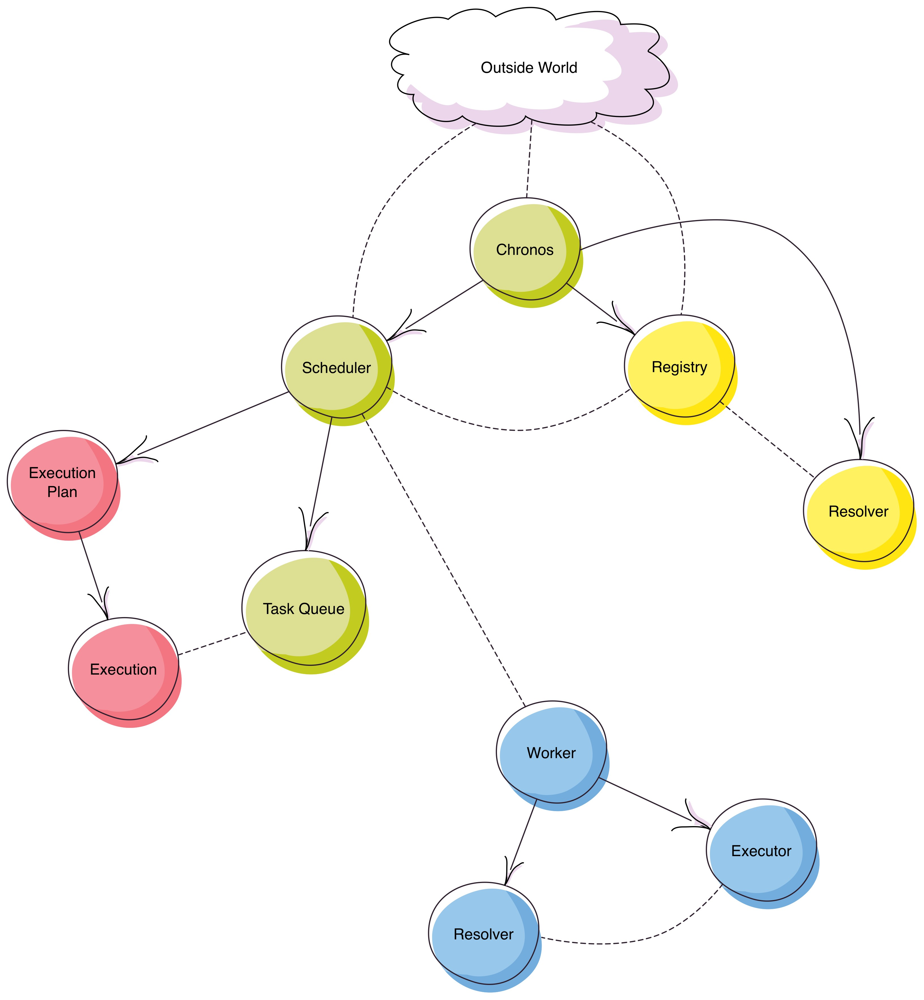
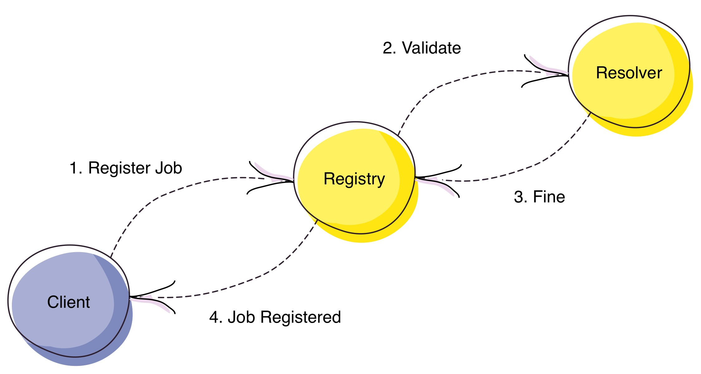
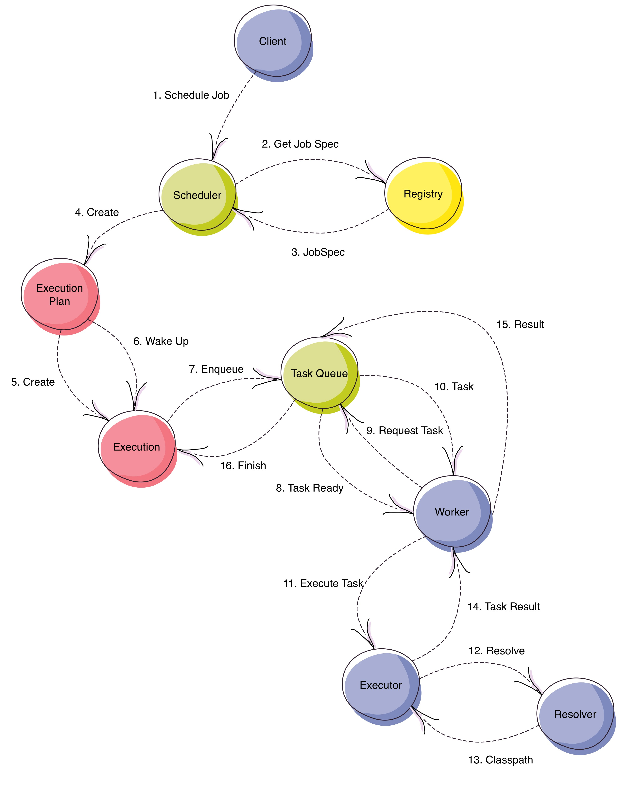

# Chronos

Chronos is a fault-tolerant distributed task scheduler platform that runs on the JVM. The aim of the project is
the implementation of a reliable system able to run large amount of scheduled tasks without single points of failure.

To achieve that, Chronos is composed of a cluster of scheduler nodes and ad hoc worker nodes that connect to this
cluster and request for work to be sent to them. It's basically a generalization of the [distributed worker
pattern](http://letitcrash.com/post/29044669086/balancing-workload-across-nodes-with-akka-2) (and in fact the
implementation owes a lot to the previous post).

## Terminology

These are the most common terms used across the documentation to describe the platform.

* **JobSpec**: A *JobSpec* is the meta definition of a runnable job. It contains information about the implementation 
 of the job, the artifact in that contains that implementation and the parameters it accepts (among other things).
* **ExecutionPlan**: An *ExecutionPlan* is the main controller of runnable jobs. It is in charge of creating new
 execution instances and to trigger them at the appropriate moment in time.
* **Execution**: An *Execution* is an instance of a runnable job. These are managed internally inside Chronos
 although client applications can access the data they hold in order to get information of the different state
 changes of a given execution or what was the execution outcome (if finished).
* **Registry**: It's a sort of repository in which all the available *JobSpecs* are kept.
* **Scheduler**: The main core component of the platform, in charge of scheduling executions, triggering them and
 send them to the worker instances.
* **Worker**: Ad-hoc node, not member of the scheduling cluster, that performs the actual execution of the job
 that was scheduled in the first place.
 
## Topology

## How does it work?

### Registering Jobs

Chronos doesn't know anything about jobs that haven't been registered in withing the system yet. So before being able
to schedule any kind of task, we first need to tell Chronos what are the specific details of that kind of task
implementation.
 
Following diagram shows how this process works: 

It is itself quite self-explanatory and compound of the following steps:

 1. A client sends a request to the Registry saying that it wants to register job **A**.
 2. The Registry communicates with the Resolver to validate the job details it has received.
 3. The Resolver replies back saying that the specification looks right.
 4. The Registry stores the job specification in within itself and replies back to the client saying that the job
 has been accepted.

### Scheduling Jobs

The scheduling (and execution) process it's much more involved than the previous one and goes through very different
phases until it reaches the point in which a specific task has been completed.

Following diagram tries to depict this process:

The set of steps of this process are as follows:

 1. A client requests to schedule a previously registered job specification (as per a trigger definition).
 2. The Scheduler asks the Registry about the job details of that specific job.
 3. The Registry replies back with the previously requested job details.
 4. The Scheduler then creates a new instance of an Execution Plan. Which is responsible to manage the the triggering
  of the job itself.
 5. The Execution Plan creates a new Execution in `Scheduled` state.
 6. At the triggered specific time, the Execution Plan notifies the Execution to wake up
 7. The Execution attempts to enqueue a task in the *pending tasks* queue.
 8. The Task Queue notifies the Worker nodes that there are tasks pending to be executed.
 9. Non busy Worker nodes reply back asking for new tasks to work on
 10. The Task Queue delivers one of the pending tasks to a Worker node.
 11. The Worker sends the task itself to an executor, which knows how to execute the task.
 12. The Executor asks the Resolver for all the dependencies needed to run the task.
 13. The Resolver replies back with the previously requested dependencies.
 14. The Executor replies to the Worker with result of that specific task.
 15. The Worker sends the execution result to the Task Queue. At this point, the Task Queue will get back to point
  number 8 if there are more pending tasks.
 16. The Task Queue notifies the Execution instance that the execution job has been finished. At this point, the
  Execution Plan can create and trigger more Executions according to its trigger rules.